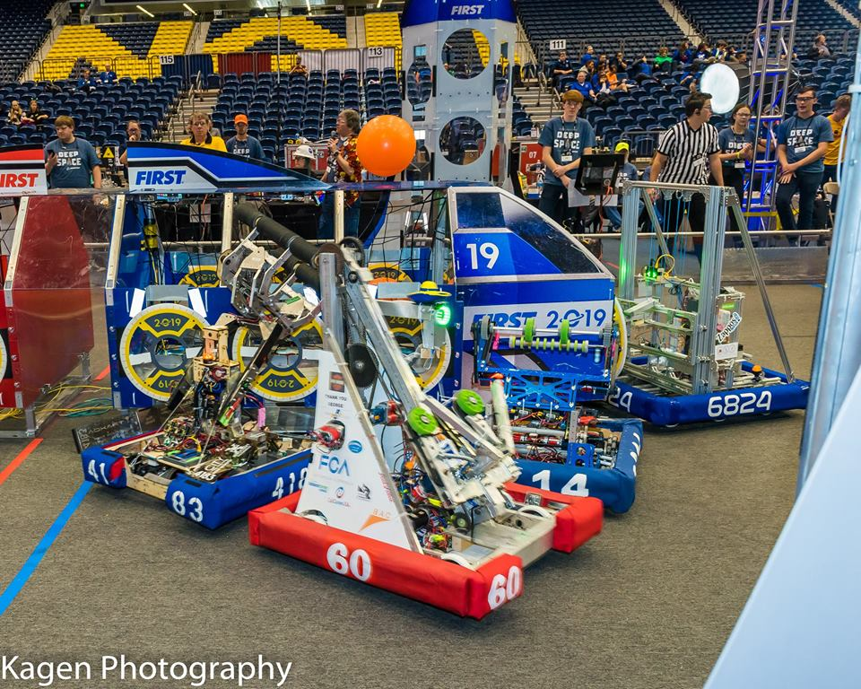

### FIRST Robotics Competition

Combining the excitement of sport with the rigors of science and technology. We call FIRST Robotics Competition the ultimate Sport for the Mind. High-school student participants call it “the hardest fun you’ll ever have.”

Under strict rules, limited time and resources, teams of students are challenged to raise funds, design a team "brand," hone teamwork skills, and build and program industrial-size robots to play a difficult field game against like-minded competitors. It’s as close to real-world engineering as a student can get. Volunteer professional mentors lend their time and talents to guide each team. Each season ends with an exciting FIRST Championship.

## Resources
- ### [The Blue Alliance](https://www.thebluealliance.com/team/60/2019)
- ### [FIRST Vision and Mission](https://www.firstinspires.org/about/vision-and-mission)

