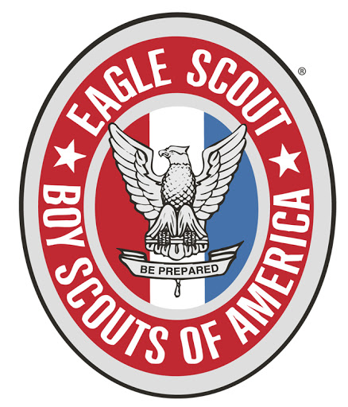

## Scouts

#### [Home](https://jscholl23.github.io/)

Definition of Eagle Scout by [Merriam-Webster](https://www.merriam-webster.com/dictionary/Eagle%20Scout).
1 : a Boy Scout who has reached the highest level of achievement in scouting.
2 : a straight-arrow and self-reliant man.

